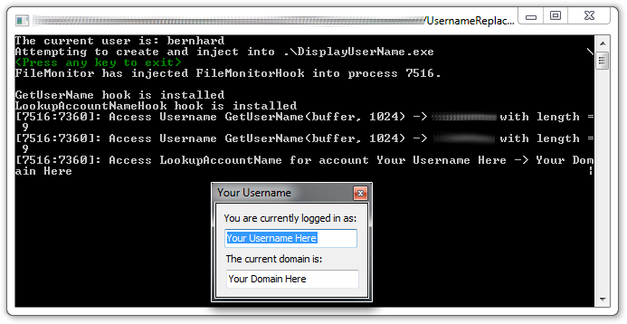

# UsernameReplacer

Have you ever wondered whether an app behaves differenty if another user is logged into the computer? - Don't wait no more!

This handy tool let's you run every app and it will detect a custom user name. Most of the code is straigth from the EasyHook Tutorial.

## Screenshot

The shown app is [DisplayUsername](https://github.com/wendelb/DisplayUserName)

## Configuration

The Replacer reads all parameters from the `App.config`. The folloging items are used:

* `TargetExe`: The Application that should be started
* `Params`: All params that should be submitted via command line
* `UserName`: The Username that should be reported to the calling app

## License

This project is MIT-licensed